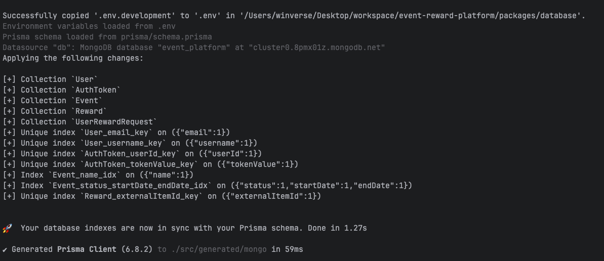
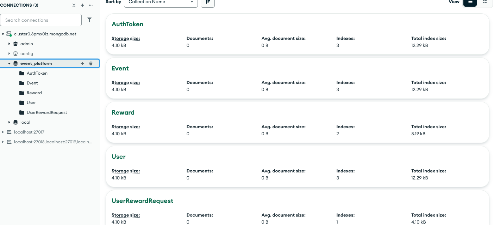
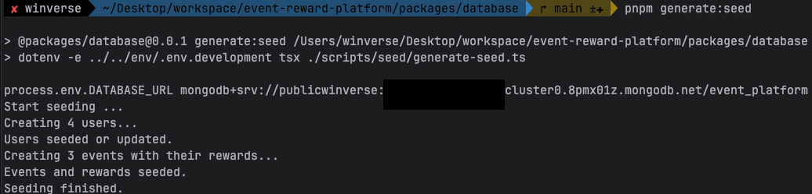
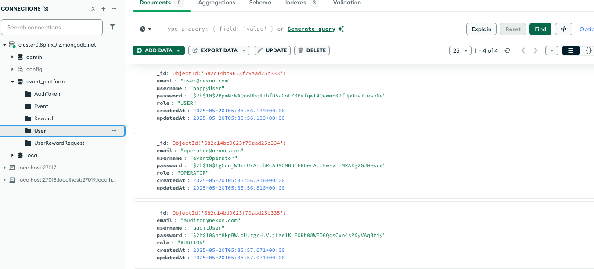
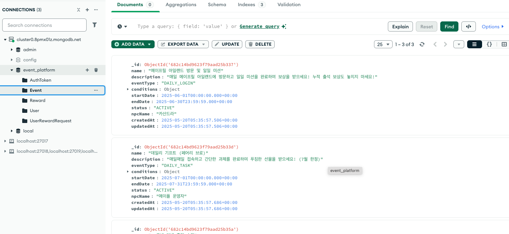
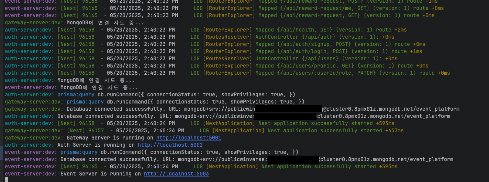
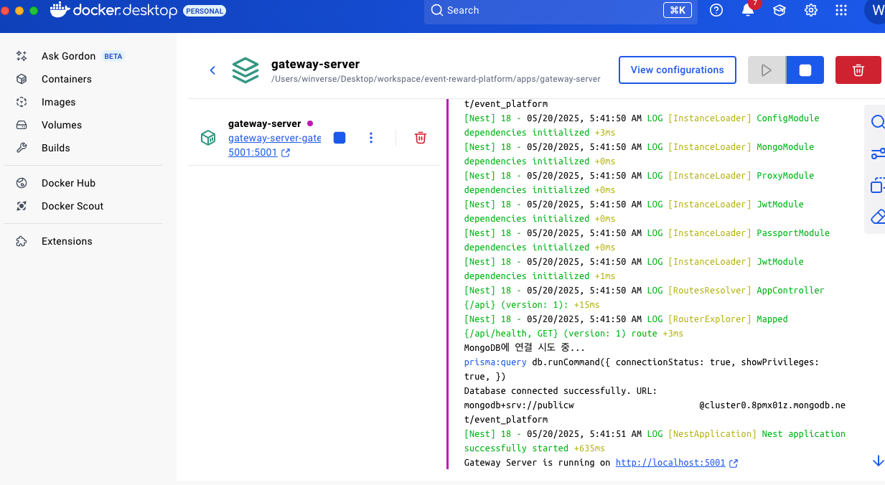
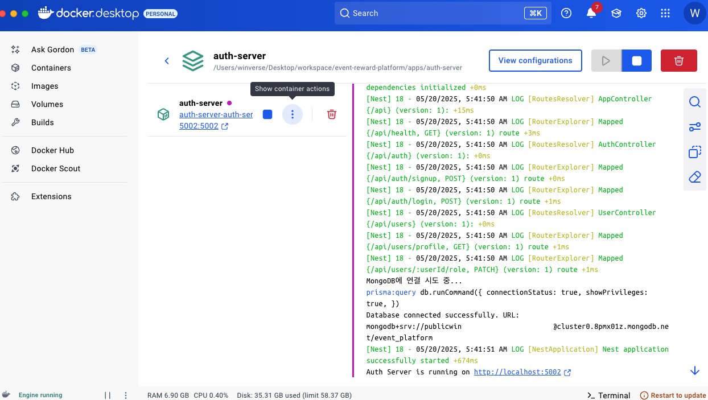
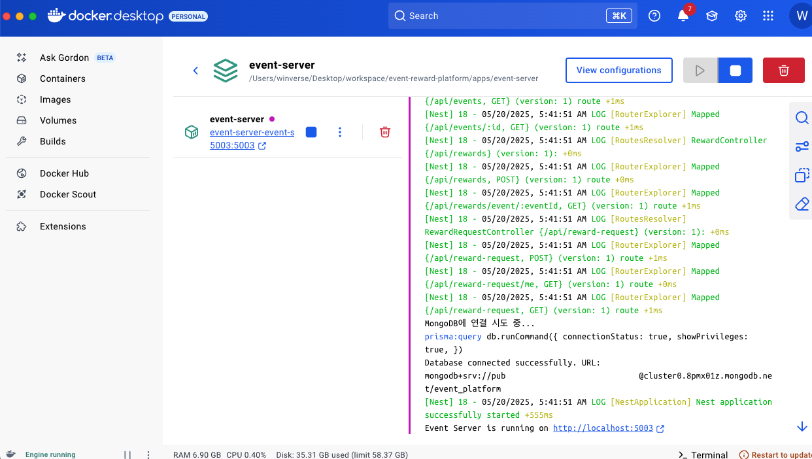

# 이벤트 보상 플랫폼 개발
- 개발 고민 과정은 다음 [문서](./document/design-decisions.md)를 참고 해주세요.
- 해당 문서는 서버 동작에 중점을 두고 작성 되었습니다.

# 1. Setup Env

- MongoDB 셋팅을 위해서 다음 문서를 참고해주세요
  - [문서](document/setup-mongo-atlas.md)
- 위에서 얻은 결과를 통해서 ENV 파일을 작성합니다.
- ENV 파일의 DB에서 `DATABASE_URL`만 변경하면 됩니다.

```aiignore
 # ./env/.env.developemnt
   # ENV
    NODE_ENV=development
    
    # APP
    GATEWAY_SERVER_PORT=5001
    AUTH_SERVER_PORT=5002
    EVENT_SERVER_PORT=5003
    
    # API
    GATEWAY_API_HOST=http://localhost:5001
    AUTH_API_HOST=http://localhost:5002
    EVENT_API_HOST=http://localhost:5003
    
    # DB
    DATABASE_PROVIDER=mongodb
    DATABASE_URL=mongodb+srv://<username>:<password>@cluster0.8pmx01z.mongodb.net/<database>
    
    # JWT
    JWT_SECRET_KEY=ce566fb48209c4876d163980aaafc0dd1105117d034062449664b0e5349f220b
    JWT_EXPIRES_IN=1h
```
    - JWT_SECRET_KEY는 openssl rand -hex 32 를 이용 했습니다.

- Production 실행을 위해서 ./.env.production 파일도 만들어 줍니다.
```aiignore
 # ./env/.env.production
   # ENV
    NODE_ENV=production
    
    # APP
    GATEWAY_SERVER_PORT=5001
    AUTH_SERVER_PORT=5002
    EVENT_SERVER_PORT=5003
    
    # API
    GATEWAY_API_HOST=http://localhost:5001
    AUTH_API_HOST=http://localhost:5002
    EVENT_API_HOST=http://localhost:5003
    
    # DB
    DATABASE_PROVIDER=mongodb
    DATABASE_URL=mongodb+srv://<username>:<password>@cluster0.8pmx01z.mongodb.net/<database>
    
    # JWT
    JWT_SECRET_KEY=ce566fb48209c4876d163980aaafc0dd1105117d034062449664b0e5349f220b
    JWT_EXPIRES_IN=1h

```

# 2. dependency install
```bash
   # node 18.20.8 (LTS)
   # pnpm >= 8
   pnpm install
```

# 3. Create Schema
```
   # 최상단에서 경로에서 실행 해줍니다.
   pnpm prisma:init
```

## MongoDB에 스키마가 만들어집니다.
  - 
  - 
  
- 2. 스키마 관련 타입 생성

# 4. Generate Seed (필요한 경우)

```bash
    cd /packages/database
    pnpm generate:seed
```

## 결과
- 
- 
- 

# 5. 어플리케이션 실행 

## 1. Dev 환경 실행

```bash
    pnpm dev
```

## 결과
- 


## 2. Prod 환경 실행

```bash
    
    # 1. 실행 권한 부여
    chmod +x scripts/docker-compose-up.sh
    chmod +x scripts/docker-compose-down.sh
  
    # 실행
    pnpm prod:up
    
    # 제거
    pnpm prod:down
```

## 결과
- 
- 
- 