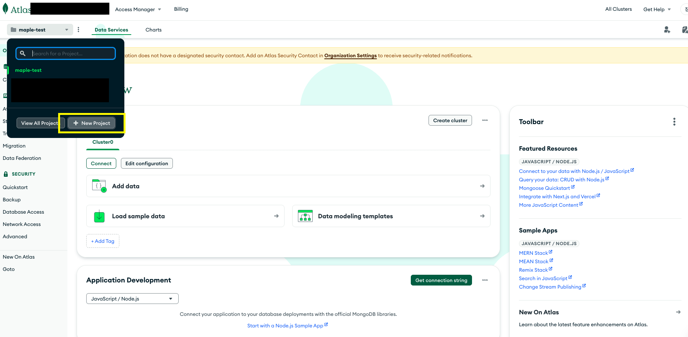
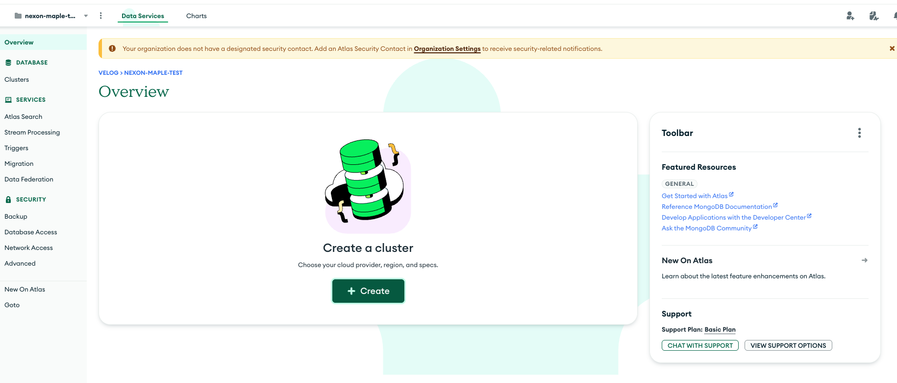
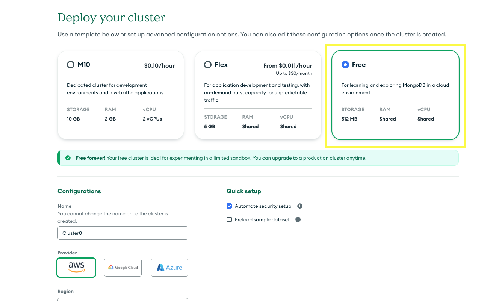
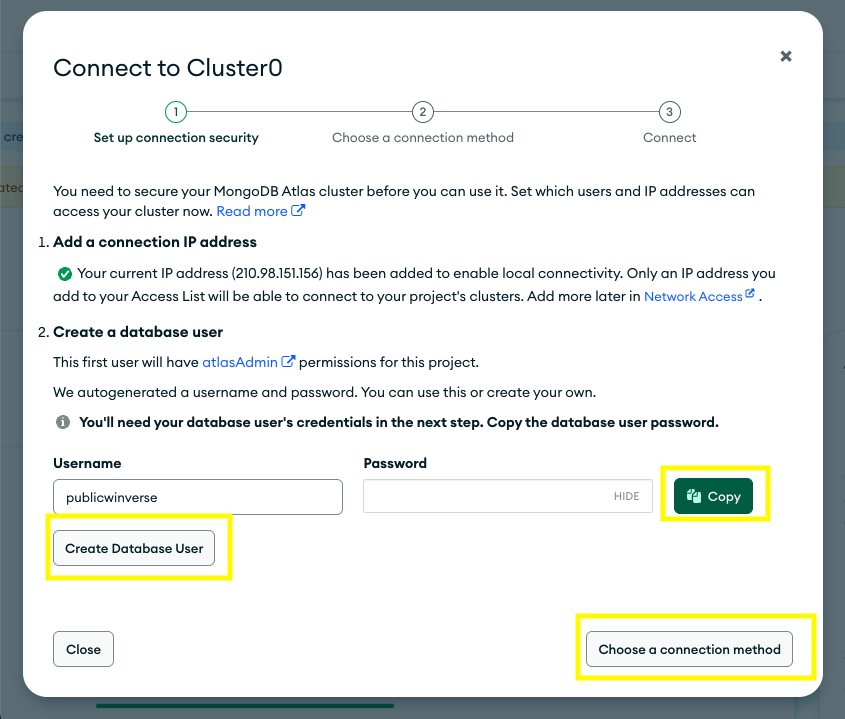
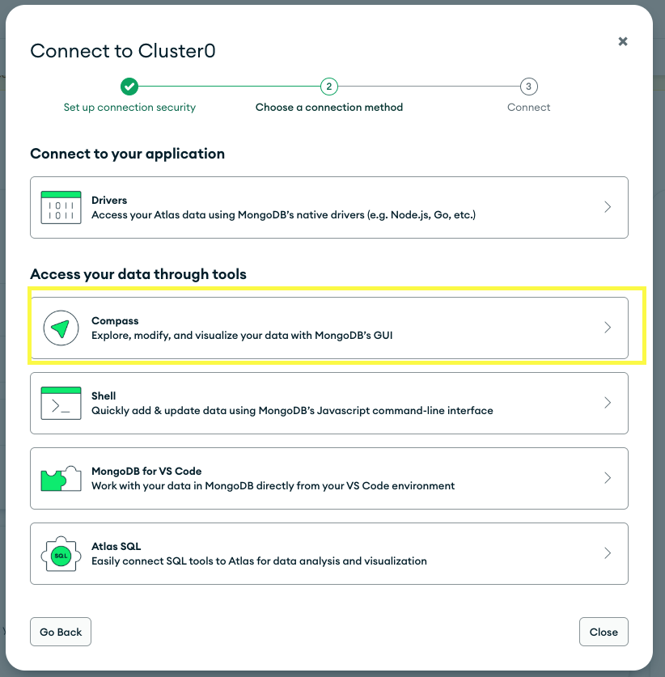
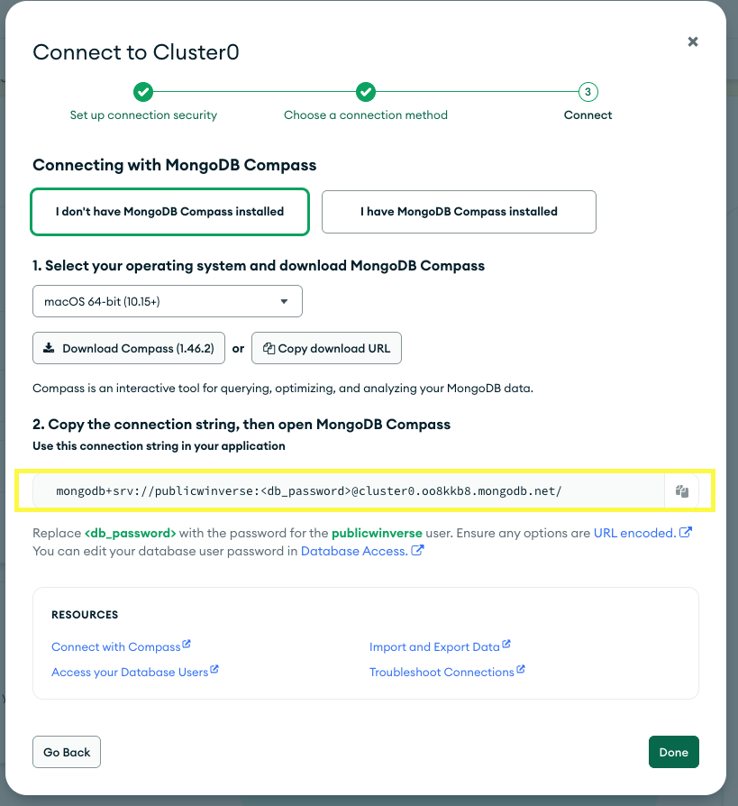

# MongoDB Atlas Setup
## 1. MongoDB Atlas 계정 생성

### 1. 계정 생성

1. [MongoDB Atlas 웹사이트](https://www.mongodb.com/cloud/atlas/register)에 접속합니다.
2. 이메일, 비밀번호, 이름을 입력하여 계정을 생성합니다.
3. 이용 약관에 동의하고 계정을 생성합니다.

###  2. 조직 및 프로젝트 설정

1. 처음 로그인하면 조직을 생성하라는 메시지가 표시됩니다.
2. 조직 이름을 입력하고 "Next"를 클릭합니다.

### 3. 프로젝트 생성

1. 프로젝트 이름을 입력하고 "Create Project"를 클릭합니다.



### 4. 클러스터 생성 및 설정

1. "Build a Database" 버튼을 클릭합니다.
2. 무료 공유 클러스터(M0)를 선택합니다.

3. 클라우드 제공업체와 지역을 선택합니다.
4. "Create Cluster" 버튼을 클릭합니다.


### 5. 보안 설정



1. 데이터베이스 사용자 생성:
    - 사용자 이름과 암호를 설정합니다.
    - "Create Database User" 버튼을 클릭합니다.  
    - **이때 패스워드를 안전한 곳에 저장해 합니다!**


### 6. 데이터베이스 연결



1. "Connect" 버튼을 클릭합니다.
2. Compass 연결 방법을 선택합니다 (예: "Connect your application").


### 6. 데이터베이스 연결 주소 얻기


1. 연결 문자열을 복사합니다.
2. 이 문자열을 여러분의 애플리케이션 환경 변수에 추가합니다:
4. DB이름을 자유롭게 해도 되지만 저는 `event_platform` 으로 하였습니다.
5. 아래와 같은 형식이 되면 됩니다.
```
DATABASE_URL=mongodb+srv://<username>:<password>@cluster0.example.mongodb.net/<dbname>
```

